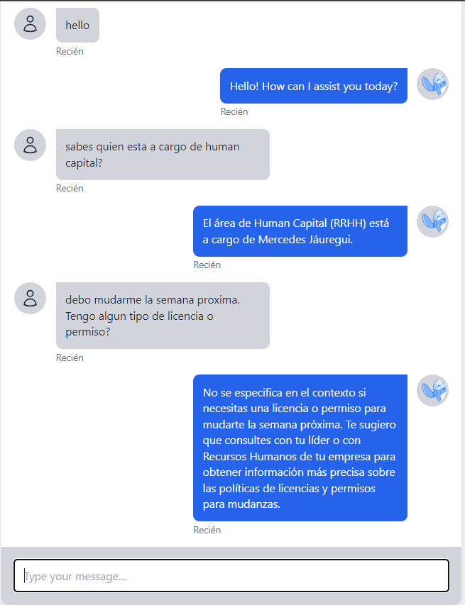

# Patagonian Chatbot Service

This project consists of a frontend developed with Next.js that interacts with a backend Flask service. The backend uses OpenAI to generate chatbot responses.



## Frontend: Next.js Client

### Setup and Usage

1. Navigate to the client directory:

```bash
cd path/to/client
```

2. Install dependencies:

```bash
npm install
```

3. Start the development server:

```bash
npm run dev
```

Open [http://localhost:3000](http://localhost:3000) with your browser to see the result.

### Features

- Real-time chat interface.
- Interaction with Flask backend to get chatbot responses.
- Customizable chat themes.

### Code Overview

The main component is `Page`, which handles the chat interface, sending messages, and displaying bot responses.

## Backend: Flask Service

### Setup and Usage

1. Navigate to the Flask service directory:

```bash
cd path/to/flask/service
```

2. Install Python dependencies:

```bash
pip install -r requirements.txt
```

3. Set the OpenAI API key by creating a `.env` file:

```bash
echo "OPENAI_API_KEY=your_openai_api_key" > .env
```

4. Start the Flask app:

```bash
python app.py
```

The service will start on [http://127.0.0.1:5000](http://127.0.0.1:5000).

### Features

- API endpoint for generating chatbot responses.
- Use of OpenAI for chatbot logic.
- Handling of chat history for context-aware responses.

### Code Overview

The main class `cbfs` initializes the chatbot, loads necessary resources, and handles chat interactions. The Flask routes provide endpoints for interacting with the frontend.

